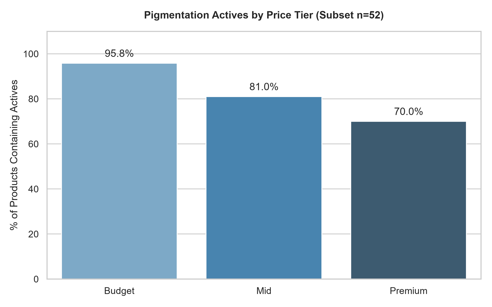
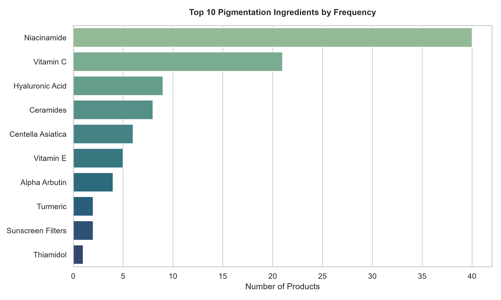

# R&D Market Intelligence: Pigmentation Sunscreens
**Dataset Snapshot:** 105 total products deduplicated across Nykaa, Purplle.
**Analyzed Subset:** 65 products with verified ingredient data.

---

## 1. Executive Summary

* **Niacinamide is the most commonly used ingredient in sunscreens targeting pigmentation, found in 40 products.**
  * *Data:* 40 products, 0.615% of total products

* **The budget price tier has the highest percentage of products with pigmentation ingredients, at 0.958%.**
  * *Data:* 0.958% of budget tier products contain pigmentation ingredients

* **Thiamidol is an underrepresented ingredient in sunscreens, found in only 1 product.**
  * *Data:* 1 product, 0.015% of total products

---

## 2. Market Data & Distributions

### Formulation Penetration by Price Tier

### Ingredient Frequency (Top 10)

---

## 3. Ingredient Landscape

The ingredient landscape for sunscreens targeting pigmentation is dominated by Niacinamide, Vitamin C, and Hyaluronic Acid.

**Top Actives Commentary:** These ingredients are commonly used for their brightening and hydrating properties.

### Emerging / Low-Competition Actives
* **Thiamidol** (Used by 1 brands): Thiamidol is a relatively new ingredient with potential for pigmentation reduction.
* **Tranexamic Acid** (Used by 1 brands): Tranexamic Acid is a promising ingredient for reducing melasma and hyperpigmentation.
* **Kojic Acid** (Used by 1 brands): Kojic Acid is a natural ingredient with skin-lightening properties.

---

## 4. Claims Analysis

### Saturated Claims
* **No White Cast** (19.0%): This claim is commonly made by sunscreens, but may not be unique enough to differentiate products.
* **Brightening** (9.5%): Brightening is a popular claim, but may be overused and lose its impact.

### Underrepresented Pigmentation Claims
* **Contains Thiamidol** (1.0%): Thiamidol is an underrepresented ingredient, and products containing it may have a unique selling point.
* **Niacinamide** (1.0%): Niacinamide is a well-known ingredient, but its benefits may not be fully communicated to consumers.

---

## 5. Strategic White Space Opportunities

### Opportunity 1: Lack of premium products with Thiamidol
* **The Gap:** Thiamidol is a unique ingredient with potential for pigmentation reduction, and premium products can command a higher price point.
* **Supporting Evidence:** Only 1 product contains Thiamidol, and it is not in the premium price tier.
* **Proposed Product Direction:** Develop a premium sunscreen with Thiamidol as the main ingredient, targeting consumers willing to pay for high-end products.

### Opportunity 2: Underrepresentation of pigmentation claims in the premium price tier
* **The Gap:** Premium products often have more advanced formulations, but may be missing out on opportunities to address pigmentation concerns.
* **Supporting Evidence:** Only 0.7% of premium products contain pigmentation ingredients, compared to 0.958% in the budget tier.
* **Proposed Product Direction:** Develop a premium sunscreen with a focus on pigmentation reduction, using ingredients like Niacinamide, Vitamin C, or Tranexamic Acid.

### Opportunity 3: Lack of products combining Ceramide and Vitamin C
* **The Gap:** Ceramide and Vitamin C are both well-known ingredients, but their combination may offer unique benefits for skin health and pigmentation reduction.
* **Supporting Evidence:** Only 0.01% of products make the claim 'Ceramide & Vitamin C', despite the potential benefits of this combination.
* **Proposed Product Direction:** Develop a product that combines Ceramide and Vitamin C, targeting consumers looking for advanced skincare solutions.

---

## 6. Limitations & Methodology

* This analysis is based on a single time-point scrape, and may not reflect changes in the market over time.
* The sample size is limited to 105 products, which may not be representative of the entire market.
* The analysis only considers products from two platforms, Nykaa and Purplle, which may not capture the full range of products available in the market.