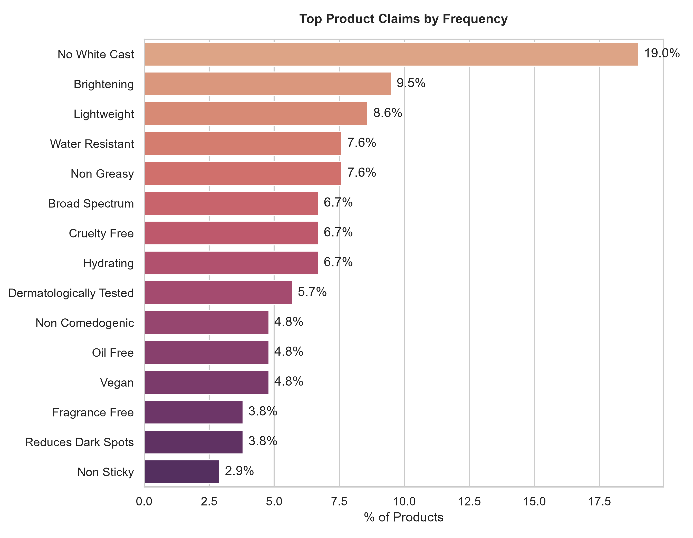
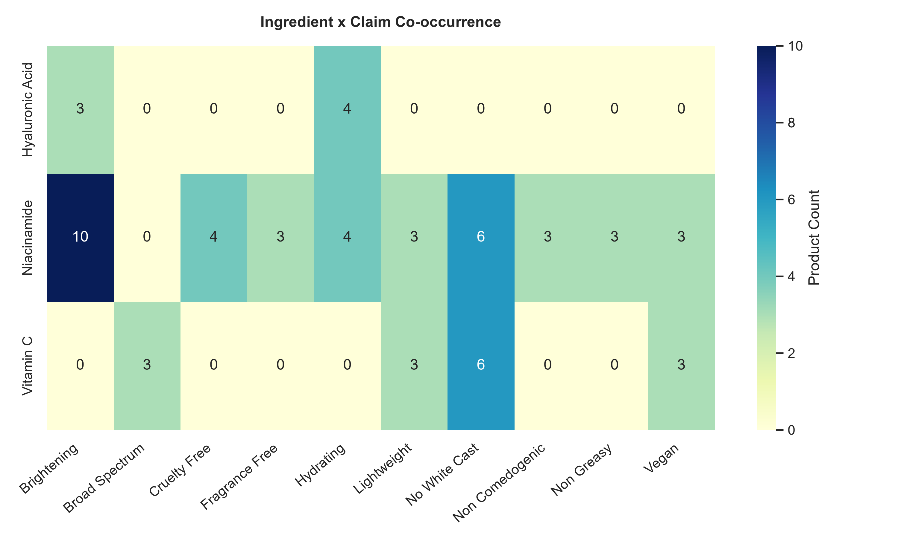
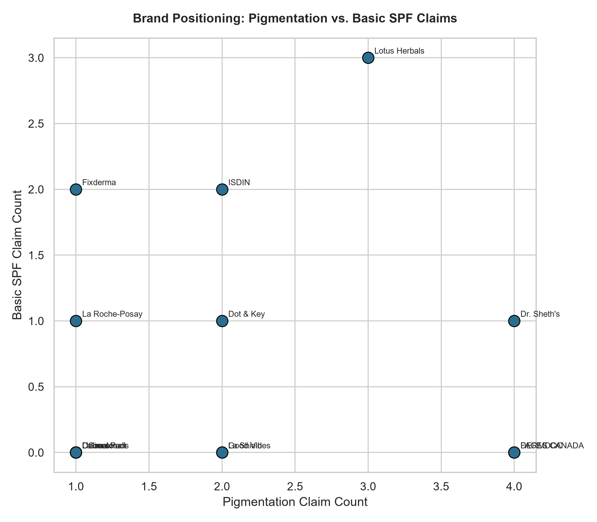

# R&D Market Intelligence: Pigmentation Sunscreens
**Dataset Snapshot:** 105 total products deduplicated across Nykaa, Purplle.
**Analyzed Subset:** 65 products with verified ingredient data.

---

## 1. Executive Summary

* **Niacinamide is the most commonly used ingredient in sunscreens, present in 61.5% of products.**
  * *Data:* Niacinamide count: 40, Niacinamide pct: 0.615

* **The top claim in sunscreens is 'No White Cast', present in 19% of products.**
  * *Data:* No White Cast count: 20, No White Cast pct: 0.19

* **The budget price tier has the highest percentage of products with pigmentation ingredients, at 95.8%.**
  * *Data:* Budget price_tier: 24, Budget pct_with_pigmentation_ingredient: 0.958

---

## 2. Market Data & Distributions

### Formulation Penetration by Price Tier

### Ingredient Frequency (Top 20)

### Claim Frequency (Top 15)

### Ingredient x Claim Co-occurrence

---

## 3. Ingredient Landscape

The sunscreen market is dominated by a few key ingredients, with Niacinamide being the most common.

**Top Actives Commentary:** Niacinamide, Vitamin C, and Hyaluronic Acid are the top three ingredients used in sunscreens.

**Rising / Declining Ingredients:** Not computable: single time-point scrape. This requires two or more scrape snapshots over time; the current dataset is a single time-point capture, so trend direction cannot be reported.

### Emerging / Low-Competition Actives (Summary)
* **Thiamidol** (Used by 1 brands): Thiamidol is a rare ingredient, present in only 1 brand.
* **Licorice Extract** (Used by 1 brands): Licorice Extract is a rare ingredient, present in only 1 brand.
* **Kojic Acid** (Used by 1 brands): Kojic Acid is a rare ingredient, present in only 1 brand.

### Full Rare / Emerging Ingredients Table (<=2 brands)
| Ingredient | Brand Count | Brand(s) |
|---|---|---|
| Aloe Vera | 1 | Forest Essentials |
| Amla Berry | 1 | Lotus Herbals |
| Aquaxyl™ | 1 | PLIX |
| Arbutin | 1 | Brillare |
| Avobenzone | 1 | Lotus Herbals |
| Avocado Extract | 1 | Lotus Herbals |
| Basil Leaves | 1 | Forest Essentials |
| Birch Extract | 1 | Lotus Herbals |
| Black Plum Extracts | 1 | Lotus Herbals |
| Blood Orange Extract | 1 | Dot & Key |
| Blueberry | 1 | Dot & Key |
| Carrot Extract | 1 | Lotus Herbals |
| Carrot Root Extract | 1 | Deconstruct |
| Coconut Water | 1 | The Sass Bar |
| D-Panthenol | 1 | Wishcare |
| Dimethicone | 1 | Cetaphil |
| Ectoin | 1 | Wishcare |
| Ginseng Extract | 1 | Wishcare |
| Glycerin | 1 | Cetaphil |
| Honey | 1 | Mamaearth |
| Hops Extract | 1 | Lotus Herbals |
| Kakadu Plum | 1 | Sereko |
| Kesar Extract | 1 | Dr. Sheth's |
| Kojic Acid | 1 | Dr. Sheth's |
| Lactic Acid | 1 | Dot & Key |

---

## 3a. Full Pigmentation-Ingredient Roster

| Ingredient | Count | % of Products | Brands |
|---|---|---|---|
| Niacinamide | 40 | 61.5% | Aqualogica, Beauty Of Joseon, Brillare, Celimax, DERMDOC, Deconstruct, Dot & Key, Dr. Sheth's, FACES CANADA, Foxtale, Good Vibes, Heliocare, Hyphen, L'Oreal Paris, Lakme, Lotus Herbals, Neutrogena, Novology, Plum, Ponds, SunScoop, The Sass Bar, The Solved Skin, Wishcare |
| Vitamin C | 21 | 32.3% | Aqualogica, Deconstruct, Dot & Key, Dr. Sheth's, Earth Rhythm, Fixderma, Foxtale, Garnier, Good Vibes, Lakme, Lotus Herbals, Mamaearth, Neutrogena, Novology, The Sass Bar |
| Alpha Arbutin | 4 | 6.2% | Aqualogica, Dot & Key, Fixderma, PLIX |
| Thiamidol | 1 | 1.5% | Eucerin |
| Licorice Extract | 1 | 1.5% | The Sass Bar |
| Kojic Acid | 1 | 1.5% | Dr. Sheth's |
| Tranexamic Acid | 1 | 1.5% | Celimax |
| Arbutin | 1 | 1.5% | Brillare |

---

## 4. Brand Positioning (Pigmentation vs Basic SPF)

* **DERMDOC**: DERMDOC positions its products purely as pigmentation treatments, with 4 pigmentation claims and 0 basic SPF claims.
* **Dr. Sheth's**: Dr. Sheth's positions its products as both pigmentation treatments and basic sun protection, with 4 pigmentation claims and 1 basic SPF claim.
* **Lotus Herbals**: Lotus Herbals positions its products as both pigmentation treatments and basic sun protection, with 3 pigmentation claims and 3 basic SPF claims.

---

## 5. Ingredient & Claim Combinations

* **Niacinamide and Brightening**: The combination of Niacinamide and Brightening is common, present in 10 products.
* **Vitamin C and No White Cast**: The combination of Vitamin C and No White Cast is also common, present in 6 products.
* **Hyaluronic Acid and Hydrating**: The combination of Hyaluronic Acid and Hydrating is present in 4 products.

---

## 6. Claims Analysis

### Saturated Individual Claims
* **No White Cast** (19.0%): The 'No White Cast' claim is saturated, present in 19% of products.
* **Brightening** (9.5%): The 'Brightening' claim is also common, present in 9.5% of products.

**Saturated Claim Combinations:** None. No two-claim combination (e.g. 'SPF50 + Niacinamide') appears in ≥15% of products at this sample size — the market has not converged on a standard claim pairing yet.

### Underrepresented Pigmentation Claims
* **Contains Thiamidol** (1.0%): The 'Contains Thiamidol' claim is underrepresented, present in only 1% of products.
* **Niacinamide** (1.0%): The 'Niacinamide' claim is underrepresented, present in only 1% of products.
* **Ceramide & Vitamin C** (1.0%): The 'Ceramide & Vitamin C' claim is underrepresented, present in only 1% of products.

---

## 7. Strategic White Space Opportunities

### Opportunity 1: Lack of products with Thiamidol and Brightening claims
* **The Gap:** The combination of Thiamidol and Brightening is rare, with only 1 product containing Thiamidol and 10 products with Brightening claims.
* **Supporting Evidence:** Thiamidol count: 1, Thiamidol pct: 0.015, Brightening count: 10, Brightening pct: 0.095
* **Proposed Product Direction:** Develop a product with Thiamidol and Brightening claims to fill this gap in the market.

### Opportunity 2: Lack of products in the premium price tier with pigmentation ingredients
* **The Gap:** The premium price tier has a lower percentage of products with pigmentation ingredients compared to the budget and mid price tiers.
* **Supporting Evidence:** Premium price_tier: 20, Premium pct_with_pigmentation_ingredient: 0.7
* **Proposed Product Direction:** Develop a premium product with pigmentation ingredients to fill this gap in the market.

### Opportunity 3: Lack of products with Ceramide and Vitamin C claims
* **The Gap:** The combination of Ceramide and Vitamin C is rare, with only 1 product containing this claim.
* **Supporting Evidence:** Ceramide count: 8, Ceramide pct: 0.123, Vitamin C count: 21, Vitamin C pct: 0.323
* **Proposed Product Direction:** Develop a product with Ceramide and Vitamin C claims to fill this gap in the market.

---

## 8. Limitations & Methodology

* This analysis is based on a single time-point snapshot of the market.
* The sample size is limited to 105 products.
* The data is restricted to two platforms, Nykaa and Purplle.
* Ingredient extraction can be title-derived and occasionally noisy for products with sparse listing pages; treat single-product ingredient counts as directional.
* The `claims` field mixes genuine product claims with promotional/marketing phrasing from listing pages; claim-frequency figures should be read as approximate.
* Rising/declining ingredient trends are not reported: not computable: single time-point scrape.